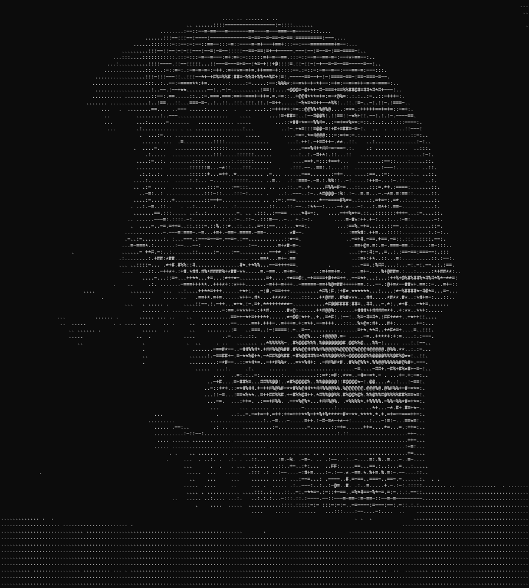
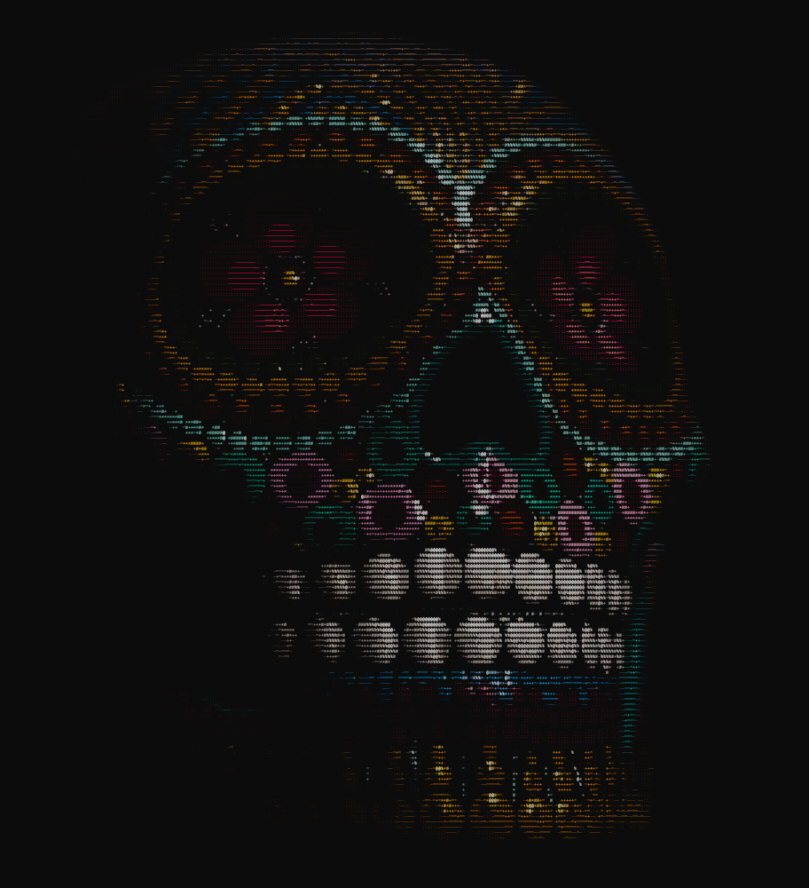

# Starlet Image Sandbox

[](https://isocpp.org/std/the-standard)
[](./LICENSE)

A C++ playground for experimenting with images loaded using **Starlet Serializer.**

## Features
- Supported Image Formats: **BMP**, **TGA**

- Output to **Console ASCII**



- Output to **Coloured Console ASCII**



## Usage
```bash
# Basic usage
./starlet-image-sandbox

# Specify an image file
./starlet-image-sandbox -p path/to/image

# Adjust ASCII scaling
./starlet-image-sandbox -x 8 -y 16

# Use coloured output mode
./starlet-image-sandbox -m ascii_colour

# Custom ASCII gradient
./starlet-image-sandbox -g " .:-=+*#%@"
```

### Options:
- `--help, -h` - Show help message
- `--path, -p <path>` - Image file path (default: beetle.tga)
- `--scale-x, -x <int>` - Horizontal scaling factor (default: 16)
- `--scale-y, -y <int>` - Vertical scaling factor (default: 32)
- `--gradient, -g <str>` - ASCII gradient string (default: '@%#*+=-:. ')
- `--mode, -m <mode>` - Output mode: `ascii` or `ascii_colour` (default: ascii)

<br/>

## Prerequisites
- CMake 3.14+
- C++20 compatible compiler

## Building the Project
This project uses **CMake**. Follow these steps to build:

```bash
# Clone the Repostiory
git clone https://github.com/masonlet/starlet-image-sandbox.git
cd starlet-image-sandbox

# Configure and build
cmake -B build
cmake --build build -DCMAKE_EXPORT_COMPILE_COMMANDS=ON 
```
`-DCMAKE_EXPORT_COMPILE_COMMANDS=ON` flag generates a `compile_commands.json` file  
Can be safely omitted on Windows if you're using Visual Studio
